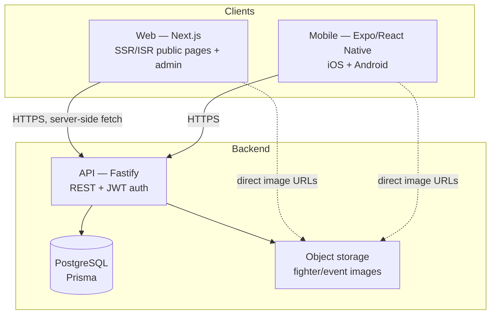

# NMFC — System Design

Design for the NMFC fighter/event/rankings platform: one shared API serving a web app and a
mobile app, backed by Postgres.

Status: proposed. Sections marked **Decision** need your sign-off before implementation.

---

## 1. Scope

**v1 (in scope)**
- Fighter profiles — bio, physical stats, career record, fight history
- Events and fight cards — upcoming and past, with matchups and results
- Rankings — per weight class
- Admin tooling to enter and edit all of the above

**Explicitly out of v1**
- Public user accounts, predictions, comments, forums
- Live/round-by-round scoring
- Ticketing or payments
- Multi-promotion data (NMFC only)

**Non-functional targets**

| Concern | Target |
|---|---|
| Scale | Hundreds of fighters, tens of events/year, low thousands of daily readers |
| Read/write ratio | Overwhelmingly read-heavy; writes only from a handful of admins |
| Latency | Public pages < 500ms server response |
| Availability | Best-effort; a few minutes of downtime is acceptable |
| Cost | $0–10/month |

The scale target matters: this is a **content site**, not a high-traffic transactional system.
It justifies simple choices — one API instance, one Postgres, no cache layer, no queue.

---

## 2. Architecture



**Why a separate API rather than Next.js route handlers**: the mobile app needs the same
data. Putting business logic in Next.js would force mobile to either duplicate it or depend
on the web deployment. One Fastify service keeps a single source of truth for both clients.

**Layering inside the API** — keep it thin but separated:

```
apps/api/src/
  routes/        HTTP concerns only: parse, validate, serialize
  services/      business logic: rankings, record computation, result recording
  db/            Prisma client + query helpers
  auth/          JWT issue/verify, admin guard
  schemas/       Zod request/response schemas (source of shared types)
```

Route handlers should not touch Prisma directly. Result recording in particular
(§5) has real invariants and belongs in a service.

---

## 3. Data model

### 3.1 Problems with the current schema

The scaffold schema works but has gaps that get expensive to fix once real data exists:

| # | Issue | Consequence |
|---|---|---|
| 1 | `Fight.winnerId` is a bare `String`, not a relation | Can reference a fighter who isn't in the fight, or a deleted one. No DB-level integrity. |
| 2 | Outcome is implied by `winnerId == null` | Ambiguous — is it a draw, a no-contest, or not yet fought? Three very different states. |
| 3 | `wins/losses/draws` stored on `Fighter`, also derivable from `Fight` | Two sources of truth. They will drift. |
| 4 | `@@unique([weightClass, rank])` | Reordering rankings collides mid-update. Swapping ranks 1 and 2 fails without temp values or deferred constraints. |
| 5 | No slugs | URLs are `/fighters/cmsw5mab70000yzr7`. Bad for SEO and unshareable — a fight site lives on search traffic. |
| 6 | `Event.status` is a free-form `String` | Typos become data ("Scheduled" vs "scheduled"). |
| 7 | No bout ordering on a card | Can't express main event vs prelims, or display a card in the right order. |
| 8 | No indexes on `Fight.eventId`, `Event.date`, `Fighter.weightClass` | Fine at current size, but these are every hot query path. |

### 3.2 Proposed schema changes

**Outcome as an explicit enum** — replaces the ambiguous nullable winner:

```prisma
enum FightStatus {
  SCHEDULED
  COMPLETED
  CANCELLED
}

enum FightOutcome {
  WIN_A        // fighterA won
  WIN_B        // fighterB won
  DRAW
  NO_CONTEST
}
```

`Fight.status` starts `SCHEDULED` with `outcome = null`; recording a result sets
`status = COMPLETED` and a non-null `outcome`. A `WIN_*` outcome makes the winner
unambiguous without a foreign key that could point anywhere.

**Other changes:**
- `Fight.boutOrder Int` — display order on the card; highest is the main event
- `Fight.isTitleFight Boolean @default(false)` — title fights render differently and matter for rankings
- `Event.status` → enum (`SCHEDULED | COMPLETED | CANCELLED`)
- `slug String @unique` on `Fighter` and `Event`, generated from name with a numeric suffix on collision
- `Ranking`: drop `@@unique([weightClass, rank])`, keep `@@unique([weightClass, fighterId])`.
  Uniqueness of *rank* is enforced in the service on write, not by the DB — this makes
  reordering a single transaction instead of a constraint dance.
- Indexes on `Fight.eventId`, `Event.date`, `Fighter.weightClass`, plus the slug uniques

### 3.3 Fighter record — **Decision**

The `wins/losses/draws` fields duplicate what `Fight` rows already say. Three options:

| Option | How | Trade-off |
|---|---|---|
| **A. Derive on read** | Compute from `Fight` rows each query | Always correct; no drift possible. Extra aggregate per fighter page — negligible at our scale. |
| **B. Denormalized cache** | Keep columns, recompute in the same transaction that records a result | Fast reads. Can drift if any write path forgets; needs a periodic reconciliation job. |
| **C. Hybrid** | Derive as the source of truth, cache into the columns for list views | Best of both, most code. |

**Recommendation: A.** At hundreds of fighters this is a trivial query, and correctness for
free is worth more than micro-optimized reads. Revisit only if a listing page gets slow.

There's a wrinkle either way: fighters usually have a **pre-NMFC record** from other
promotions. That can't be derived from our `Fight` table. Suggest explicit
`priorWins / priorLosses / priorDraws` columns, with the displayed record being
prior + derived-from-NMFC. This keeps "imported history" and "what we recorded"
cleanly separated.

---

## 4. API design

REST over HTTPS, JSON. Versioned under `/v1` from day one — cheap now, and mobile clients
in the wild can't be force-upgraded later.

### Public (unauthenticated, read-only)

```
GET  /v1/fighters?weightClass=&q=&page=      list + search
GET  /v1/fighters/:slug                       profile + fight history
GET  /v1/events?status=&page=                 list
GET  /v1/events/:slug                         event + full card, bouts ordered
GET  /v1/rankings                             all weight classes
GET  /v1/rankings/:weightClass                one division
```

### Admin (JWT required)

```
POST   /v1/auth/login
POST   /v1/admin/fighters          PATCH/DELETE /v1/admin/fighters/:id
POST   /v1/admin/events            PATCH/DELETE /v1/admin/events/:id
POST   /v1/admin/events/:id/fights     add bout to card
PATCH  /v1/admin/fights/:id/result     record outcome
PUT    /v1/admin/rankings/:weightClass full ordered list, replaces division
POST   /v1/admin/uploads               presigned URL for images
```

**Conventions**
- Public lookups by **slug**, admin mutations by **id**. Slugs are for humans and can change;
  ids are stable.
- Pagination: `?page=&limit=` with `{ data, page, limit, total }`. Offset paging is fine —
  no dataset here is large enough to need cursors.
- Errors: consistent `{ error: { code, message, details? } }`, correct HTTP status.
- Validation: **Zod** schemas at the boundary. Every request body validated before it
  reaches a service.
- Rankings replace the whole division in one `PUT` rather than per-row PATCHes — ranking is
  inherently an ordered list, and one atomic write avoids half-applied reorderings.

### Shared types

`packages/shared` currently hand-maintains types that duplicate the Prisma schema — they
will drift. Better: define Zod schemas in the API, infer TypeScript types from them, and
export those through `packages/shared` for web and mobile. One definition, validation and
types both derived from it.

---

## 5. Recording a result — the one real invariant

This is the only write with meaningful complexity, so it's worth specifying. Recording a
fight result must, **in a single transaction**:

1. Verify the fight is `SCHEDULED` (recording twice must not double-count)
2. Set `status = COMPLETED`, `outcome`, `method`, `round`, `time`
3. If the event's every bout is now complete, set the event `COMPLETED`

With derived records (§3.3 option A) there is no counter to update — a large part of why
that option is attractive. Rankings are **not** auto-updated here; see §6.

---

## 6. Rankings — **Decision**

| Option | Description | Trade-off |
|---|---|---|
| **Manual** | Admin sets the order per division | Total editorial control; matches how real promotions actually rank. Requires upkeep. |
| **Computed** | Algorithm from wins/losses/recency/opponent quality | Zero upkeep, but needs enough fights to be meaningful and will produce odd results early on. |

**Recommendation: manual for v1.** A new promotion has too few fights for any algorithm to
produce a credible ordering, and rankings are an editorial statement. The `PUT
/v1/admin/rankings/:weightClass` endpoint plus a drag-to-reorder admin UI covers it. Keep a
computed *suggestion* as a later enhancement — surface a proposed order, let the admin
accept or override.

---

## 7. Media storage

Fighter portraits and event posters. Requirements: cheap, works from both clients, no
credentials in the app bundle.

**Approach**: object storage with presigned uploads. Admin requests a presigned URL from
the API, uploads directly to storage, sends back the resulting key. The API never proxies
image bytes, and no storage credentials ever reach a client.

- **Cloudflare R2** — S3-compatible, no egress fees, generous free tier. Recommended.
- **Supabase Storage** — reasonable if we also use Supabase for Postgres.
- **Local filesystem** — dev only; ephemeral on most hosts.

Store the **key**, not a full URL, so the CDN domain can change without a data migration.
Derive display URLs at read time. Generate a couple of preset sizes (thumbnail for lists,
full for profiles) at upload — mobile especially shouldn't download a 2MB portrait for a
40px avatar.

---

## 8. Auth

v1 has no public accounts, so this only guards the admin surface.

- Small `AdminUser` table: email, `argon2` password hash, role
- `POST /v1/auth/login` → short-lived JWT access token (~15 min) + longer refresh token
- Web stores tokens in httpOnly cookies; mobile in `expo-secure-store` — **never**
  `AsyncStorage`, which is plaintext on disk
- A `requireAdmin` Fastify hook guards every `/v1/admin/*` route
- Rate-limit login attempts (`@fastify/rate-limit`)

Deliberately **not** using a third-party auth provider: a handful of internal admins doesn't
justify the dependency or cost. The design leaves room for public accounts later — that's
when a provider starts earning its keep.

---

## 9. Web app

Next.js App Router. Rendering strategy per route type:

| Route | Strategy | Why |
|---|---|---|
| Fighter profile, event page | **ISR**, revalidate ~5 min | Content changes rarely; needs to be crawlable |
| Rankings | **ISR**, revalidate ~5 min | Same |
| Live event results | **SSR** or short revalidate | Freshness matters on fight night |
| Admin | **Client-side, no caching** | Authenticated, always current |

SEO is a first-class concern for a fight database — most traffic will arrive via searches
for a fighter's name. That means slug URLs (§3.2), per-page metadata, OpenGraph images, and
`Fighter`/`Event` JSON-LD structured data.

Data fetching happens **server-side** so the API URL and any tokens stay off the client.

---

## 10. Mobile app

Expo / React Native, sharing types (not UI) with web.

- **expo-router** for file-based navigation, mirroring web's structure
- **TanStack Query** for server state — caching, retries, and offline behavior for free
- Screens: Events (list → card detail), Fighters (search → profile), Rankings
- Read-only in v1; no admin on mobile
- Cache the last successful response so the app degrades gracefully on a bad connection at
  a venue
- Distribution via **EAS Build**. App Store/Play accounts are only needed at actual
  publish time ($99/yr Apple, $25 one-time Google)

---

## 11. Deployment

| Component | Host | Cost |
|---|---|---|
| Web | Vercel (free tier) | $0 |
| API | Fly.io or Render (free/hobby tier) | $0 |
| Postgres | Neon or Supabase (free tier) | $0 |
| Images | Cloudflare R2 (free tier) | $0 |
| Mobile builds | EAS (free tier) | $0 |

Environments: **local** (Postgres via Homebrew, as set up), **production**. A staging
environment isn't worth the overhead at this size — add one when a bad deploy would actually
hurt.

Two caveats on free tiers, both real:
- Free API hosts **sleep when idle**; the first request after a quiet period can take
  several seconds. Mitigate with a cheap uptime pinger, or upgrade to a ~$5/mo tier if it
  becomes annoying.
- Free Postgres tiers have connection limits well below what a naive serverless setup
  opens. A single long-lived Fastify instance with one Prisma pool stays comfortably within
  them — but this is a reason not to move the API to serverless functions later without
  adding a pooler.

CI via GitHub Actions: typecheck, lint, and `prisma migrate deploy` on merge to `main`.
Migrations run as a deploy step, never automatically at app boot.

---

## 12. Security

- All traffic HTTPS; HSTS on the web app
- Zod validation on every request body; Prisma parameterizes all queries
- CORS restricted to known origins — the scaffold currently has `origin: true` (allow all),
  which must be tightened before production
- Rate limiting on login and on public reads
- Secrets in host environment config, never committed — `.env` is gitignored and should stay
  that way
- Admin actions audit-logged (who changed what, when); results and rankings are the
  public record of the promotion, and "who edited this" will eventually be asked

---

## 13. Build order

Each phase should end somewhere shippable.

**Phase 1 — Data foundation**
Schema revisions from §3.2, migration, expanded seed data.

**Phase 2 — API**
Public read endpoints, Zod schemas, shared types wired to `packages/shared`.
*Shippable: real data over HTTP.*

**Phase 3 — Web public site**
Fighter profile, event page, rankings, home, search. SEO metadata.
*Shippable: a public site.*

**Phase 4 — Admin**
Auth, then CRUD for fighters/events/fights, result recording, ranking reorder, image upload.
*Shippable: you can run the site without a developer.*

**Phase 5 — Mobile**
Expo app against the same API.
*Shippable: TestFlight/internal build.*

**Phase 6 — Deploy**
Production hosting, CI, custom domain.

Phases 3 and 5 could run in parallel once the API is stable, but sequential is simpler
solo.

---

## 14. Decisions needed

| # | Decision | Recommendation |
|---|---|---|
| 1 | Fighter record: derived vs denormalized (§3.3) | Derived |
| 2 | Track pre-NMFC records? (§3.3) | Yes — `prior*` columns |
| 3 | Rankings: manual vs computed (§6) | Manual for v1 |
| 4 | Image storage provider (§7) | Cloudflare R2 |
| 5 | Weight classes — do the eight in the schema match NMFC's actual divisions? | Confirm; also whether women's divisions are needed |
| 6 | Is there existing fighter/event data to import? | Affects Phase 1 |

Items 5 and 6 are the ones I can't answer from the code — they're facts about how NMFC
actually operates.
